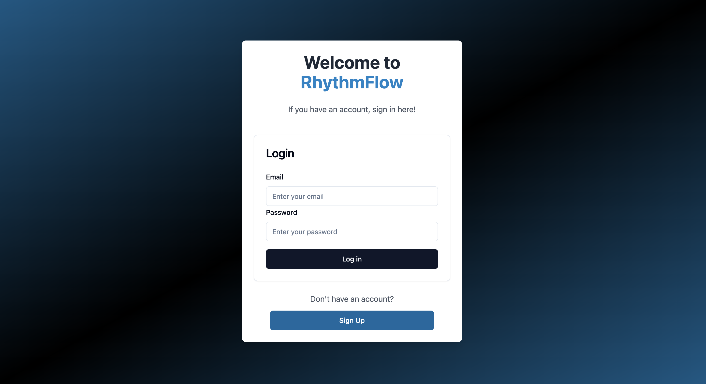
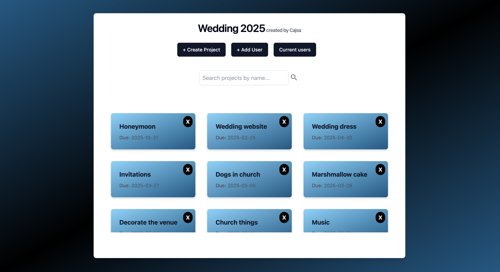
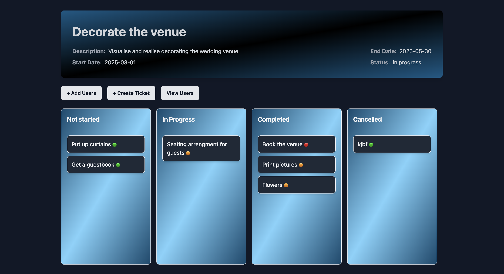

# RhythmFlow frontend

Deployed application: [**RhythmFlow**](https://rhythm-flow-frontend.onrender.com/)





## Overview

This is a **Task Management Application** designed to help users manage tasks. The application allows users to manage their workspaces, projects, and tickets effectively. Roles are handled at the workspace level, and creators of workspaces can assign users to their workspace. A dynamic Kanban drag-and-drop feature ensures efficient ticket management within projects.

The project is a React + TypeScript frontend that integrates with this backend: *https://github.com/cajsanu/rhythm-flow-backend*. The project was made during three weeks of intense keyboard abuse and neglect of human nature. The focus was on not touching the already existing backend and to implement as many features as possible. The backend is deployed to Render and the Postgres database is deployed using Neon.

Note: As a result of using free resources for deployment the deployed application is veeery slow...

## Get started

### Prerequisites

Ensure you have the following installed:

- Node.js (>=16.x)
- Yarn

### Follow these steps to get your project up and running locally:

1. **Clone the Repository**  
   Clone the project to your local machine:

   ```bash
   git clone https://github.com/cajsanu/rhythm-flow-frontend

   ```

2. Use Yarn to **install packages** with
   `yarn install`

3. **Run** the frontend locally with `yarn dev`

## Features

- **Workspaces**

  - Users can create and manage their own workspaces.
  - Add users to your own workspace and assign roles to them.
  - Users can have their own workspaces but also be part of other workspces.

- **Projects**

  - Projects are organized within workspaces.
  - Projects can be managed within a worskapce by users with roles of owner or project manager.
  - Users can be added to and removed from projects.
  - Functionality to search projects by name.

- **Tickets**

  - Tickets are managed within projects.
  - Users who are added to the project can create and update tickets.
  - Kanban-style drag-and-drop interface for ticket management.
  - Assign users to tickets and update ticket statuses.

- **Authentication**

  - Secure login and signup using JWT-based authentication.
  - If a user is not logged in they are always redirected to _./_ (login page).
  - If the user is logged in they will be redirected to the landing page _./home{userId}_ if they for some reason go to the login page.

- **Other**
  - Conditional rendering of components based on roles of the current user.
  - Role-based access control with three different roles.

## Workflow

- Signu up or login to start managing your tasks.
- On the landing page users can see all the workspaces they are part of. They can aslo create a new workspace or navigate to any of the existing ones.
- In the workspace view users can view and search for projects and:
  - If the user is the owner of the workspace they can add other users to join their workspace, giving them a role inside the workspace.
  - If they are owners or project managers they can manage projects within the workspace.
  - If users are not part of the workspace they can't access inforamtion about the workspace or projects inside it.
- When clicking on a project the app will take the user to the project view (if the user is part of the project), where the kanban board for tickets withing the project exists.
- Tickets can be created by anyone who has been added to the project and tickets can be assigned to users in the project.

## Information about roles

- Users have roles on the workspace level.
- When a user creates a workspace they are automatically assigned the role of owner (of the workspace).
- The other possible roles are User and Project Manager.
- Project managers can create, delete and update projects in a workspace and also assign users to those projects.
- Users who have the role of basic User can create and assign tickets in a project that they have been added to.

## Technologies Used

The application leverages modern web development tools and frameworks:

- **React**: For building the user interface.
- **TypeScript**: Ensuring type safety and reducing runtime errors.
- **shadcn**: For reusable UI components.
- **TailwindCSS**: For styling and responsive design.
- **TanStack Query**: For server state management and API interaction.
- **Redux Toolkit**: For global state management.
- **React Hook Form** Integrated with **Zod**

## Testing

- Some initial e2e testig is done using Cypress.

## Future features and improvements

- More robust error handling and testing
- The whole workflow to remove users from workspaces
